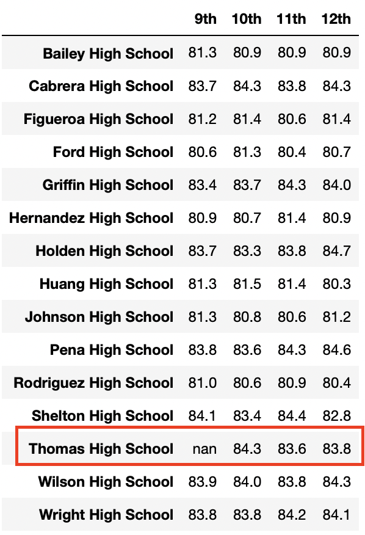

# School District Analysis

## Overview
In a previous analysis, school performance based on math and reading scores were evaluated for 15 high schools in the school district. However, the school board suspects that the grades for Thomas High School ninth graders were altered, and requested that the analysis be re-run ignoring the grades in question. To accomplish this, math and reading grades for Thomas High School ninth graders were set to NaNs in the data.

The analysis included the following:
1. Overall average scores, passing rates, school statistics for the district 
2. Average scores, passing rates, school statistics for each school
3. The top 5 and bottom 5 performing schools, based on the overall passing rate
4. The average math score for each grade level from each school
5. The average reading score for each grade level from each school
6. The scores by school spending per student, by school size, and by school type

## Resources
Data Source: 

schools_complete.csv
https://github.com/kristindong/School_District_Analysis/blob/ac6d7f1f7040e63f716088a5d304443bf3a4360f/Resources/schools_complete.csv

students_complete.csv
https://github.com/kristindong/School_District_Analysis/blob/ac6d7f1f7040e63f716088a5d304443bf3a4360f/Resources/students_complete.csv

## Results
Replacing the Thomas High School 9th grade scores had the following impacts:

* District summary - average scores and passing rates all decreased compared to the original analysis

  Before change:
  
  
  
  After change:
  
  
  
  
* School summary - Thomas High School's average reading score increased while math score, math passing rate, reading rate and overall passing rate  decreased

  Before change:
  
  
  
  After change:
  
  
  
* School ranking - the change did not impact Thomas High School's ranking. It's still ranked 2nd based on overall passing percentage.

* Math and reading scores by grade - the change set Thomas High School's 9th grade math and reading scores to NaN. It did not impact the School's average math and reading     scores for 10th, 11th, and 12th grades.

  After change math scores by grade:

  

* Scores by school spending - the change impacted the $631-$645 per student spending range. It increased the range's average reading score while lowering the math score, math passing rate, reading passing rate, and overall passing rate. It did not impact the metrics for other spending ranges.

* Scores by school size - the change increased the medium-sized school average reading score while lowering math score, math passing rate, reading passing rate, and overall passing rate. It did not impact the metrics for other school sizes.

* Scores by school type - the change increased the Charter school average reading score while lowering math score, math passing rate, reading passing rate, and overall passing rate. It did not impact the metrics for District schools.

## Summary

The changes to the school district analysis can be summarized as follows:

1. District average scores and passing rates all decreased compared to the original analysis
2. Thomas High School's average reading score increased while math score, math passing rate, reading rate and overall passing rate  decreased
3. Thomas High School's ranking remains at 2nd place based on overall passing rate
4. For the following categrories, ehe average reading score increased, while the math score, math passing rate, reading passing rate, and overall passing rate decreased:
    - $631-$645 spending range
    - Medium-sized schools
    - Charter schools

