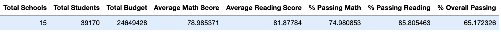
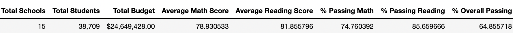
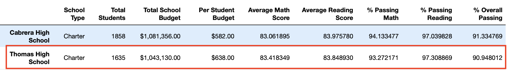
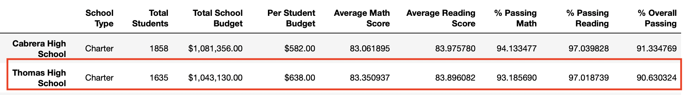

# School District Analysis

## Overview
In a previous analysis, school performance based on math and reading scores were evaluated for 15 high schools in the school district. However, the school board suspects that the grades for Thomas High School ninth graders were altered, and requested that the analysis be re-run ignoring the grades in question. To accomplish this, math and reading grades for Thomas High School ninth graders were set to NaNs in the data.

The analysis consists of the following:
1. Overall average scores, passing rates, school statistics for the district 
2. Average scores, passing rates, school statistics for each school
3. The top 5 and bottom 5 performing schools, based on the overall passing rate
4. The average math score for each grade level from each school
5. The average reading score for each grade level from each school
6. The scores by school spending per student, by school size, and by school type

## Resources
- Data Source: schools_complete.csv, students_complete.csv
  https://github.com/kristindong/Election_Analysis/blob/4c7f05a4710c51b1c07ac23febef6c424507e598/Resources/election_results.csv

## Results
Replacing the math and reading scores had the following impact:

* District summary - district average scores and passing rates changed 

  Before change
  
  
  After change
  
  
* School summary

  Before change
  
  
  After change
  
  
* School ranking

* Math and reading scores by grade

* Scores by school spending

* Scores by school size

* Scores by school type

A sample of the script and results displayed in Visual Studio Code:

The text file containing the audit results is saved here:
https://github.com/kristindong/Election_Analysis/blob/50a03a50484d6af8364f489912598d382ab73a71/analysis/election_analysis.txt

## Summary
With some modifications, the Python script used for this election audit can be used for any election, provided that the data is stored in csv format and contain county and candidate name for each vote cast. 

1. The name and path of the election results csv file and election analysis text file may need to be modified if the file name and location are not the same as those used in the code.

2. If county and candidate name are not in columns 2 and 3, respectively, the the index values in the code below will need to be adjusted to reflect the columns they are stored in the data file. 

